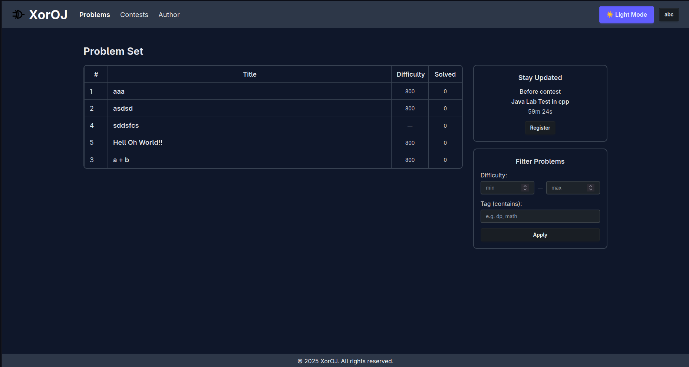
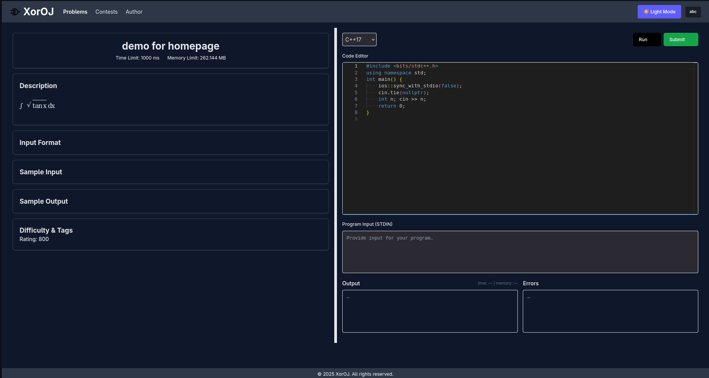
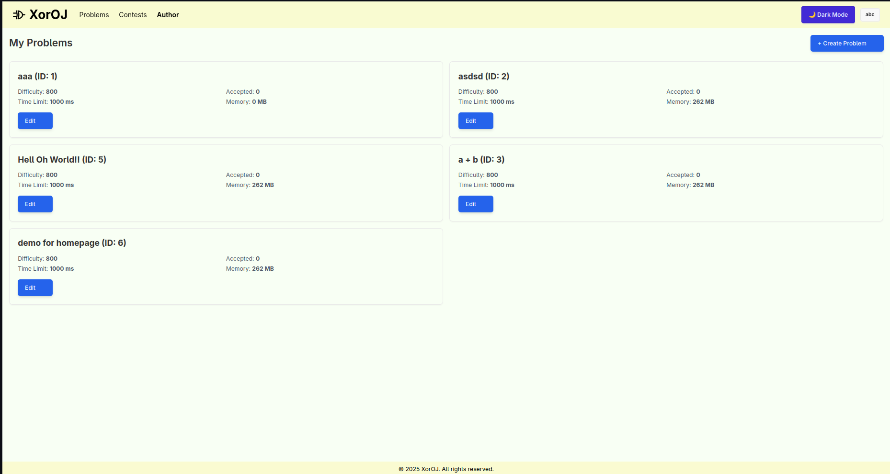
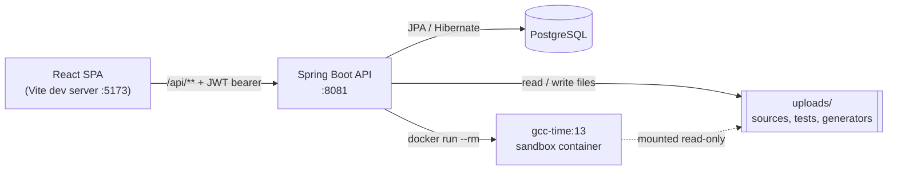
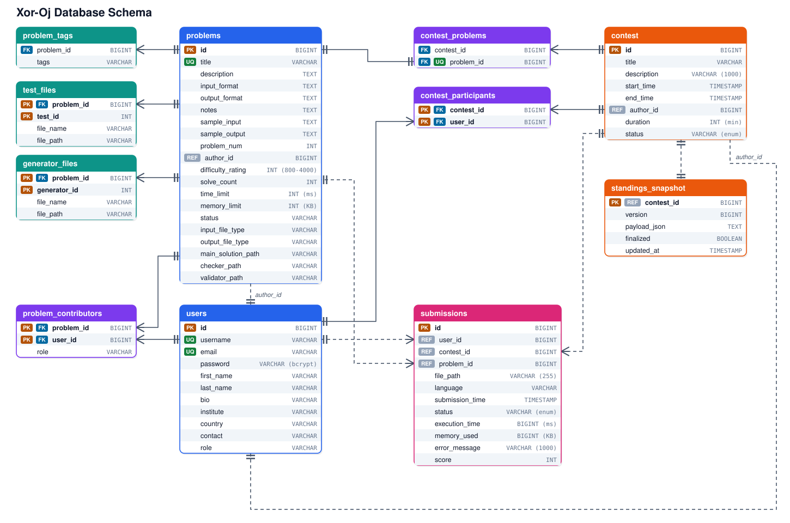
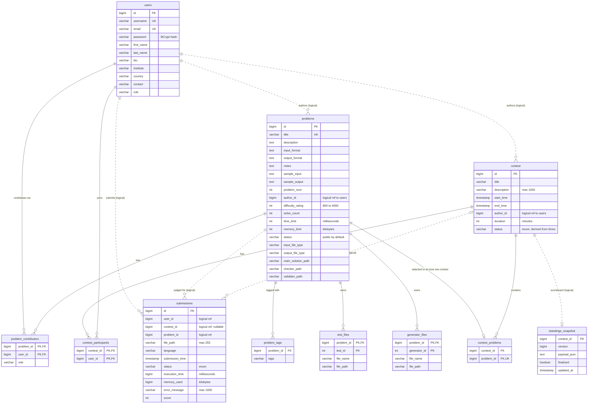
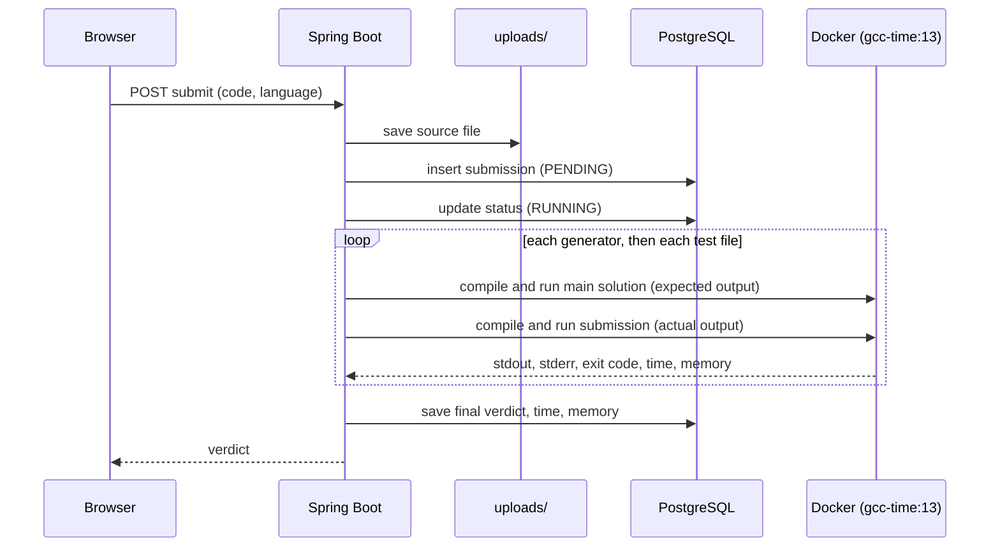

<div align="center">

# Xor-Oj

**A self-hosted online judge: author problems, run contests, and judge C/C++ submissions inside locked-down Docker containers.**


</div>

<table>
  <tr>
    <td width="33%"><br><sub><b>Problem set</b> with difficulty and tag filters and a contest countdown</sub></td>
    <td width="33%"><br><sub><b>Problem page</b> with a Monaco editor, custom input, and Run / Submit</sub></td>
    <td width="33%"><br><sub><b>Author dashboard</b> in light mode</sub></td>
  </tr>
</table>

---

## Table of Contents

1. [Overview](#overview)
2. [Features](#features)
3. [Tech Stack](#tech-stack)
4. [Architecture](#architecture)
5. [Project Structure](#project-structure)
6. [Database Design](#database-design)
7. [How Judging Works](#how-judging-works)
8. [Contests and Scoring](#contests-and-scoring)
9. [Getting Started](#getting-started)
10. [Configuration](#configuration)
11. [API Reference](#api-reference)
12. [Frontend Routes](#frontend-routes)
13. [File Storage Layout](#file-storage-layout)
14. [Development Notes](#development-notes)
15. [Known Limitations](#known-limitations)
16. [Troubleshooting](#troubleshooting)
17. [Contributing](#contributing)

---

## Overview

Xor-Oj is a small, self-contained take on platforms like Codeforces and Polygon. Anyone with an account can:

- **write problems**: statements with math, time and memory limits, tags, difficulty, a main (reference) solution, test files, and generators;
- **host contests**: schedule them, attach problems, and let people register;
- **solve and submit** from an in-browser editor, with instant verdicts;
- **follow a live ICPC-style scoreboard** while a contest runs.

Submitted code never runs on the host. Every compile and run happens in a throwaway Docker container with no network, a read-only filesystem, and CPU / memory / process limits.

---

## Features

### For solvers
- Register and log in (JWT, passwords hashed with BCrypt).
- Browse the **problem set**, filter by difficulty range and tag, and read statements rendered with **MathJax**.
- Write code in a **Monaco editor** (the same editor engine as VS Code), supply custom **STDIN**, and press **Run** to see output, time, and memory before submitting.
- Press **Submit** to get a verdict: `ACCEPTED`, `WRONG_ANSWER`, `TIME_LIMIT_EXCEEDED`, `MEMORY_LIMIT_EXCEEDED`, `COMPILATION_ERROR`, or `RUNTIME_ERROR`.
- A standalone **IDE page** (`/IDE/code`) for experimenting with code.
- **Profile** pages with editable details, full submission history, and contest history.
- Dark and light themes.

### For authors
- **Author dashboard** listing your problems and contests.
- **Problem editor** with tabs for general info, statement, generators, tests, and solution files.
- **Generators**: upload C++ programs that print an input; each generated input is judged against the main solution.
- **Test files**: upload fixed inputs. Expected output is produced by running the main solution.
- **Contributors** can be attached to a problem with a role.
- **Contest editor** with tabs for general info, problems, and participants.

### For contests
- Contest list with countdown timers and one-click registration.
- Per-contest problem pages, "my submissions" and "all submissions" (20 per page).
- **Live standings**: in-memory scoreboard, ICPC ordering, and a persisted snapshot that is finalized automatically once the contest ends.

---

## Tech Stack

| Layer | Technology |
| --- | --- |
| Backend | Java 24, Spring Boot 3.5.5 (Web, Security, Data JPA, Validation), Lombok, JJWT 0.12.6, Jackson Afterburner, `spring-dotenv` |
| Database | PostgreSQL, schema generated by Hibernate (`ddl-auto: update`) |
| Frontend | React 19, Vite 7, React Router 7, Tailwind CSS 3 with DaisyUI 5, Material UI 7, Monaco Editor, MathJax 3, Axios |
| Sandbox | Docker, custom image based on `gcc:13` with the `time` utility |
| Storage | Local filesystem for problem artifacts and submitted source code |

---

## Architecture



- During development, the Vite dev server **proxies `/api`** to `http://localhost:8081` (see [`frontend/vite.config.js`](frontend/vite.config.js)), so the browser only talks to one origin.
- The API is **stateless**: every request carries a JWT, validated by [`JWTFilter`](backend/src/main/java/com/Judge_Mental/XorOJ/filter/JWTFilter.java). Only `/api/auth/register` and `/api/auth/login` are public.
- Judging is **synchronous**: the submit request compiles and runs the code, then returns the verdict. Virtual threads are enabled in `application.yml`.

---

## Project Structure

```
Xor-Oj/
├── Dockerfile                    # Judge sandbox image (gcc:13 + time)
├── docs/
│   └── database-schema.svg       # Database diagram
├── backend/                      # Spring Boot application
│   ├── pom.xml
│   ├── mvnw, mvnw.cmd            # Maven wrapper
│   └── src/main/
│       ├── resources/application.yml
│       └── java/com/Judge_Mental/XorOJ/
│           ├── config/           # Security, password encoder, Jackson, scheduling, file storage
│           ├── controller/       # REST controllers
│           ├── dto/              # Response shapes (standings, submissions, problem view, ...)
│           ├── entity/           # JPA entities (+ entity/listener for id generation)
│           ├── filter/           # JWTFilter
│           ├── judge/            # CppExecutor: Docker-based compile and run
│           ├── repo/             # Spring Data repositories
│           ├── service/          # Judging, scoreboard, contests, problems, storage, ...
│           └── util/             # Small helpers
├── frontend/                     # React single-page app
│   ├── vite.config.js            # Dev server and /api proxy
│   └── src/
│       ├── api/                  # apiFetch: fetch wrapper that attaches the JWT
│       ├── auth/                 # AuthContext
│       ├── components/           # IDE, CodeEditor, MathRenderer, ContestCard, CountdownTimer, ...
│       ├── layouts/              # AppLayout (header + footer), AuthLayout
│       ├── pages/                # Route pages
│       │   ├── problem-editor/   # General, Statement, Generator, Checker, Tests, Solutions, ...
│       │   ├── contest-editor/   # General, Problems, Participants
│       │   └── profile-editor/   # Edit profile, submission history, contest history
│       └── styles/               # Global and split-pane styles
└── uploads/                      # Runtime data: problem files and submitted sources
```

---

## Database Design

The schema is generated from the JPA entities in [`backend/.../entity`](backend/src/main/java/com/Judge_Mental/XorOJ/entity). Column names are the snake_case form of the Java field names, and the contest table is called `contest` because that entity has no `@Table` annotation.

<p align="center">
  
</p>

The same schema as a text diagram that GitHub renders natively and that is easy to edit:



### Tables at a glance

| Table | Purpose |
| --- | --- |
| `users` | Accounts and profile details. `username` and `email` are unique. |
| `problems` | Statement, limits, difficulty, status, and the on-disk paths of the main solution, checker, and validator. |
| `problem_tags` | One row per tag of a problem (a Hibernate `@ElementCollection`). |
| `problem_contributors` | Many-to-many link between problems and users, with a per-problem `role`. Composite key `(problem_id, user_id)`. |
| `test_files` | Input files of a problem. Composite key `(problem_id, test_id)`, where `test_id` is a per-problem counter. |
| `generator_files` | Generator programs of a problem. Composite key `(problem_id, generator_id)`. |
| `contest` | Title, schedule, and author of a contest. |
| `contest_problems` | Join table between contests and problems. `problem_id` is unique, so a problem belongs to at most one contest. |
| `contest_participants` | Registered users of a contest. |
| `submissions` | One row per submission: language, verdict, time, memory, and the path of the saved source. |
| `standings_snapshot` | The scoreboard of a contest stored as JSON, with a version number and a `finalized` flag. |

### Design notes

- **Composite keys for owned files.** `test_files` and `generator_files` use `(problem_id, counter)` keys. The counter is assigned per problem by entity listeners, so ids start at 1 for every problem.
- **Cascade deletes.** Deleting a problem removes its contributors, tests, and generators (`ON DELETE CASCADE` plus JPA cascade).
- **Logical references.** `submissions.user_id / problem_id / contest_id`, `problems.author_id`, `contest.author_id`, and `standings_snapshot.contest_id` are plain numeric columns, not foreign keys. They appear as dashed lines in the diagram. Submission history therefore survives even if a problem or contest is changed or removed, but the database will not stop you from storing an id that does not exist.
- **Derived contest status.** `contest.status` is stored for compatibility, but the application computes the real status (`UPCOMING`, `RUNNING`, `ENDED`) from `start_time` and `end_time` on every read.
- **Files on disk.** Source code, tests, and generators are stored as files under `uploads/`. The database keeps only their paths.
- **Units.** `time_limit` is in milliseconds and `memory_limit` is in kilobytes (the editor converts to and from megabytes). `execution_time` is in milliseconds and `memory_used` in kilobytes.
- **Sequences after manual inserts.** If you insert rows by hand, resync the id sequence so new rows do not collide:

  ```sql
  SELECT setval(pg_get_serial_sequence('table_name', 'id'),
                COALESCE((SELECT MAX(id) FROM table_name), 0), true);
  ```

---

## How Judging Works



1. The request body is `{ "code": "...", "language": "cpp" }`. Only `cpp` and `c` are accepted.
2. The source is saved as `uploads/submissions/<userId>_<problemId>_<yyyyMMdd_HHmmss>_<random>.<language>` and a `PENDING` row is inserted.
3. For every **generator**, the judge runs the generator to produce an input. Then, for every **test file**, it uses the stored input. For each input it runs the main solution to get the expected output, and then the submission.
4. Each run is a fresh container:

   ```bash
   docker run --rm --network none --cpus=1 -m <memory>m --pids-limit 256 --read-only \
       -v <source dir>:/work:ro -v <out dir>:/out:rw -v <input dir>:/input:ro \
       --tmpfs /tmp:rw,noexec,nosuid,size=64m gcc-time:13 \
       bash -lc "g++ -O2 -std=c++17 /work/<file> -o /out/main && \
                 /usr/bin/time -f 'TIME_USED_MS=%e\nMEM_USED_KB=%M' timeout <seconds>s /out/main < /input/<input>"
   ```

5. Outputs are compared after trimming leading and trailing whitespace. Judging **stops at the first failing input**, and the reported time and memory are the maximum seen so far.

### Verdicts

| Verdict | Meaning |
| --- | --- |
| `PENDING` / `RUNNING` | Saved and queued / currently being judged. |
| `ACCEPTED` | Every input produced the expected output within limits. |
| `WRONG_ANSWER` | Output differs from the main solution's output. |
| `TIME_LIMIT_EXCEEDED` | The run was killed by `timeout` (exit code 124) or took longer than the limit. |
| `MEMORY_LIMIT_EXCEEDED` | The container was killed (exit code 137) or peak memory reached the limit. |
| `COMPILATION_ERROR` | `g++` failed; the first lines of the compiler output are stored as the error message. |
| `RUNTIME_ERROR` | Non-zero exit for another reason, an unsupported language, or an internal judging error. |

### Sandbox guarantees

| Protection | How |
| --- | --- |
| No network | `--network none` |
| Resource caps | `--cpus`, `-m` (memory), `--pids-limit 256` |
| Immutable filesystem | `--read-only`, source mounted `:ro`, `/tmp` is a 64 MB `noexec` tmpfs |
| Hard wall-clock cap | The Java side kills the process and force-removes the container if it overruns |
| Throwaway state | `--rm`, and a unique container name per run |

The **Run** button on a problem page uses the same sandbox with fixed limits (2000 ms, 128 MB, 1 CPU).

---

## Contests and Scoring

- A contest has a start and end time; its status is derived from the current time.
- Users **register** for a contest, and problems are attached through the contest editor.
- Scoring is **ICPC style**: more solved problems rank higher, then lower total penalty, then username.
- Penalty is the minutes from contest start to the accepted submission, **plus 20 minutes** for every earlier rejected attempt on that problem.
- Submissions made after the end time do not change the scoreboard.
- The scoreboard lives in memory for speed. It is saved to `standings_snapshot` in the last five minutes of a contest, and a scheduler (every 15 seconds) finalizes contests that have ended. A finalized snapshot ignores further updates.
- `GET /api/standings/contests/{id}` returns an `ETag`; sending it back as `If-None-Match` yields `304 Not Modified` when nothing changed.

---

## Getting Started

### Prerequisites

| Tool | Version |
| --- | --- |
| JDK | 24 (the `pom.xml` sets `java.version` to 24) |
| Node.js | 20.19 or newer (needed by Vite 7) |
| PostgreSQL | any recent version |
| Docker | running, and usable by the user who starts the backend |

### 1. Clone

```bash
git clone https://github.com/greenbinjack/Xor-Oj.git
cd Xor-Oj
```

### 2. Create the database

```sql
CREATE DATABASE xoroj;
```

### 3. Configure the backend

Create `backend/.env` (it is git-ignored). `spring-dotenv` reads it when you start the backend from the `backend/` directory:

```env
POSTGRES_URL=jdbc:postgresql://localhost:5432/xoroj
POSTGRES_USERNAME=your_username
POSTGRES_PASSWORD=your_password
JWT_SECRET=a_long_random_string_of_at_least_32_characters
```

A template is provided in [`backend/.env.example`](backend/.env.example). `JWT_SECRET` signs the login tokens, so keep it private and generate your own, for example with `openssl rand -base64 48`. The backend refuses to start if it is missing or shorter than 32 characters. Changing it later signs every user out.

Tables are created automatically on first start.

### 4. Build the judge image

From the repository root:

```bash
docker build -t gcc-time:13 .
```

The tag is hard-coded as `DOCKER_IMAGE` in [`CppExecutor.java`](backend/src/main/java/com/Judge_Mental/XorOJ/judge/CppExecutor.java); change it there if you use another tag.

### 5. Start the backend

```bash
cd backend
./mvnw spring-boot:run
```

On Windows use `mvnw.cmd spring-boot:run`. The API listens on **http://localhost:8081**.

### 6. Start the frontend

```bash
cd frontend
npm install
npm run dev
```

Open **http://localhost:5173**, register an account, and sign in. Every page except `/login` and `/register` requires a token.

### 7. Try it out

1. Go to **Author**, then **Create Problem**, fill in a title, and open the editor.
2. On the **Solutions** tab, upload a correct C++ solution as the main solution.
3. On the **Tests** tab, upload one or more input files (or add a generator).
4. Open the problem from **Problems**, write a solution, and press **Submit**.

### Production build of the frontend

```bash
cd frontend
npm run build      # output in frontend/dist
npm run preview    # serve the built bundle locally
```

---

## Configuration

| Setting | Where | Default |
| --- | --- | --- |
| Database URL, user, password | `backend/.env`: `POSTGRES_URL`, `POSTGRES_USERNAME`, `POSTGRES_PASSWORD` | none (required) |
| JWT signing secret | `backend/.env`: `JWT_SECRET` (at least 32 characters) | none (required) |
| Backend port | `server.port` in [`application.yml`](backend/src/main/resources/application.yml) | `8081` |
| Frontend to backend proxy | [`frontend/vite.config.js`](frontend/vite.config.js) | `http://localhost:8081` |
| Upload directory | `file.upload-dir` | `../uploads` (relative to `backend/`) |
| Max upload size | `spring.servlet.multipart.max-file-size` / `max-request-size` | 10 MB / 15 MB |
| Virtual threads | `submission.thread.virtual.enabled` | `true` |
| Response compression | `server.compression.*` | JSON and event streams over 512 bytes |
| Hibernate schema mode | `spring.jpa.hibernate.ddl-auto` | `update` |
| Judge image | `DOCKER_IMAGE` in `CppExecutor.java` | `gcc-time:13` |
| Process limit per run | `DEFAULT_PIDS_LIMIT` in `CppExecutor.java` | `256` |
| Standings finalizer period | `@Scheduled` in `StandingsScheduler.java` | 15 seconds |

If you change the backend port, update the proxy target in `vite.config.js` as well.

---

## API Reference

All `/api/**` routes require `Authorization: Bearer <jwt>` except register and login. Tokens are valid for one day.

### Auth
| Method | Path | Description |
| --- | --- | --- |
| POST | `/api/auth/register` | Create an account |
| POST | `/api/auth/login` | Log in and receive a JWT |

### Problems
| Method | Path | Description |
| --- | --- | --- |
| GET | `/api/problems` | List problems |
| GET | `/api/problems/{id}` | Problem view (statement, limits, tags) |

### Author dashboard
| Method | Path | Description |
| --- | --- | --- |
| POST | `/api/author/problems/init` | Create an empty problem |
| GET | `/api/author/problems/my` | Problems you authored |
| GET | `/api/author/problems/{id}` | One of your problems |
| POST | `/api/author/contests/init` | Create an empty contest |
| GET | `/api/author/contests/my` | Contests you authored |

### Problem editor (`/api/edit/problems/{problemId}`)
| Method | Path | Description |
| --- | --- | --- |
| POST | `/generalinfo` | Limits, file types, difficulty, tags |
| POST | `/statement` | Statement text, formats, samples |
| GET / POST | `/generator` | List / upload generators |
| DELETE | `/generator/{generatorId}` | Remove a generator |
| GET / POST | `/testfile` | List / upload test inputs |
| DELETE | `/testfile/{testId}` | Remove a test input |
| POST | `/solution` | Upload the main solution |

### Contests
| Method | Path | Description |
| --- | --- | --- |
| GET | `/api/contests` | List contests |
| GET | `/api/contests/{id}` | Contest summary |
| GET | `/api/contests/{id}/details` | Contest with its problems |
| POST | `/api/contests/{id}/register` | Register the current user |
| POST | `/api/edit/contests/{contestId}/generalinfo` | Edit title, schedule, description |
| POST | `/api/edit/contests/{contestId}/problems` | Set the contest's problems |

### Submissions
| Method | Path | Description |
| --- | --- | --- |
| POST | `/api/submissions/problems/{problemId}/submit` | Submit to a problem; returns the verdict |
| POST | `/api/submissions/contests/{contestId}/problems/{problemId}/submit` | Submit during a contest; also updates standings |
| GET | `/api/submissions/contests/{id}/my` | Your submissions in a contest |
| GET | `/api/submissions/contests/{id}/page/{pageNumber}` | All submissions of a contest, 20 per page |
| POST | `/api/submissions/test` | Run code with custom input (JSON) |
| POST | `/api/submissions/testfile` | Run code with an uploaded input file (multipart) |

### Standings
| Method | Path | Description |
| --- | --- | --- |
| GET | `/api/standings/contests/{contestId}` | Scoreboard snapshot (supports `If-None-Match`) |
| POST | `/api/standings/contests/{contestId}/row` | Replace one user's row |
| POST | `/api/standings/contests/{contestId}/finalize` | Finalize if the contest has ended |

### Profile
| Method | Path | Description |
| --- | --- | --- |
| GET | `/api/profile/{username}` | Public profile |
| POST | `/api/profile/edit` | Edit your profile |
| GET | `/api/profile/{username}/submissions` | Submission history |
| GET | `/api/profile/{username}/contests` | Contest history |

---

## Frontend Routes

| Route | Page |
| --- | --- |
| `/login`, `/register` | Authentication |
| `/` | Home |
| `/problems`, `/problems/:pid` | Problem set and problem page |
| `/create-problem` | Create a problem |
| `/IDE/code` | Standalone IDE |
| `/contests` | Contest list |
| `/contests/:id/view` | Contest overview |
| `/contests/:id/problems/:pid` | Problem inside a contest |
| `/contests/:id/my` | Your submissions in the contest |
| `/contests/:id/submissions/:pageNumber` | All submissions in the contest |
| `/contests/:id/standings` | Scoreboard |
| `/author`, `/author/problems`, `/author/contests` | Author dashboard |
| `/author/problems/:problemId/edit/(general\|statement\|generator\|checker\|tests\|solutions)` | Problem editor tabs |
| `/author/contests/:contestId/edit/(general\|problems\|participants)` | Contest editor tabs |
| `/profile/:username/(edit\|submissions\|contest-history)` | Profile tabs |

---

## File Storage Layout

Everything is stored under `file.upload-dir` (default `uploads/`):

```
uploads/
├── problems/
│   └── <problemId>/
│       ├── mainSolution/     # reference solution (.cpp)
│       ├── tests/            # <n>_input.txt files
│       └── generators/       # generator programs (.cpp)
└── submissions/
    └── <userId>_<problemId>_<yyyyMMdd_HHmmss>_<random>.<language>
```

---

## Development Notes

- **Lint the frontend:** `cd frontend && npm run lint`
- **Run backend tests:** `cd backend && ./mvnw test`. The test suite currently only contains the generated context-load test.
- **Database dumps:** after manually inserting rows, resync sequences as shown in [Database Design](#database-design).
- **Theme colors** used by the UI: `#FFFDF6`, `#FAF6E9`, `#DDEB9D`, `#A0C878`.

---

## Known Limitations

Xor-Oj is a work in progress. The main gaps today:

- **C and C++ only.** The editor also offers Java and Python, but the judge currently accepts only `cpp` and `c`.
- **No custom checkers or validators yet.** Verdicts come from comparing the submission's trimmed output with the main solution's output.
- **Single-node, synchronous judging.** A submit request blocks until judging finishes, and there is no distributed worker pool.

---

## Troubleshooting

| Symptom | Likely cause and fix |
| --- | --- |
| Backend fails with `Could not resolve placeholder 'JWT_SECRET'` or `JWT_SECRET must be at least 32 characters long` | Add a `JWT_SECRET` of 32 or more characters to `backend/.env` (see [`backend/.env.example`](backend/.env.example)). |
| Backend fails with a datasource error | `backend/.env` is missing or not in the directory you start the backend from; check the three `POSTGRES_*` variables. |
| Every submission is `RUNTIME_ERROR` with a Docker message | Docker is not running, or the `gcc-time:13` image is not built. Run `docker build -t gcc-time:13 .`. |
| Browser shows network errors on `/api/...` | The backend is not running on port 8081, or `vite.config.js` points at a different port. |
| Redirected to `/login` repeatedly | The JWT is missing or expired (tokens last one day); log in again. |
| `release version 24 not supported` | Your JDK is older than 24; install JDK 24 and point `JAVA_HOME` at it. |
| Duplicate key errors after manual inserts | Resync the id sequence with the `setval` snippet in [Database Design](#database-design). |
| `./mvnw: Permission denied` (Linux or macOS) | Run `chmod +x backend/mvnw`. |

---

## Contributing

Issues and pull requests are welcome. Please keep changes focused, run `npm run lint` for frontend changes, and describe how you tested the change.
